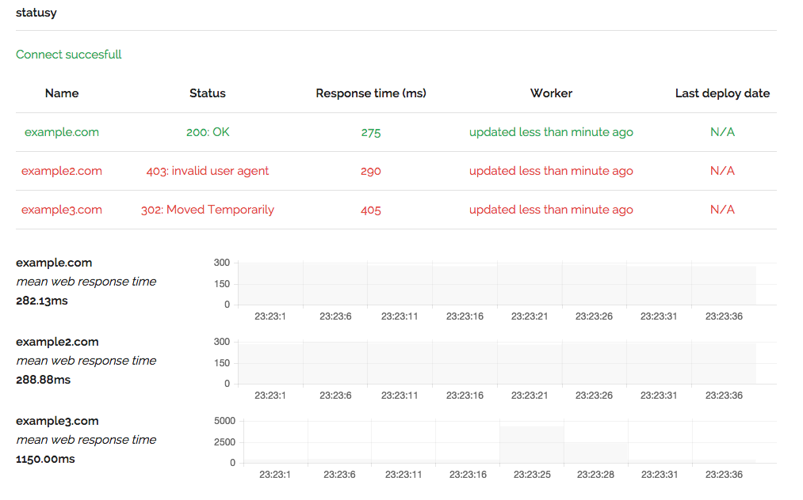

# statusy
[](https://travis-ci.org/statusy/statusy)
[](https://www.codacy.com/app/szymanskilukasz88/statusy)

## About

Real time status page v0.1.0.



Powered by nodeJS, expressJS & SocketIO.

## Documentation

### Install

1. Clone or fork this repo
2. npm install

### Configure

All configuration live in **config.js** file.

**DELAY_CHECK_SITES** - Delay time for creating request to sites (in miliseconds)

**sites** - array of objects you want to check. Site object should look like (all fields are mandatory):

```

{
  host: 'http://example.com',
  name: 'example.com',
  status: statuses.active.message, // default status
  last_deploy_date: "N/A" // default deploy date
}

```

### Run

Go to your statusy location and run

```
 node index.js
```

After that visit http://localhost:3000

### How it works

From provided configuration, statusy asynchronously send requests to sites, and update status page via websockets.

Feel free to play with multiple sites.

## Contribute

TODO

## License

MIT License.
